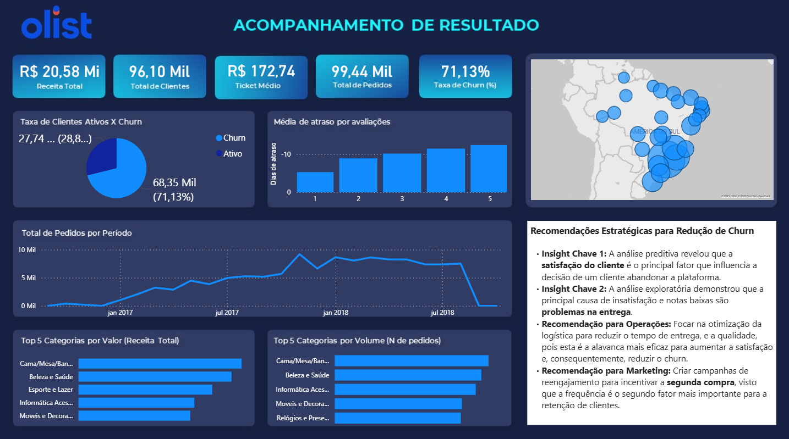
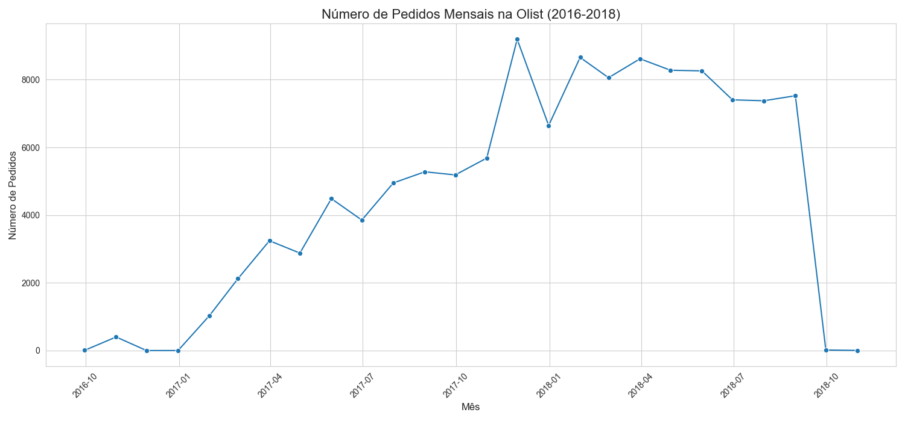
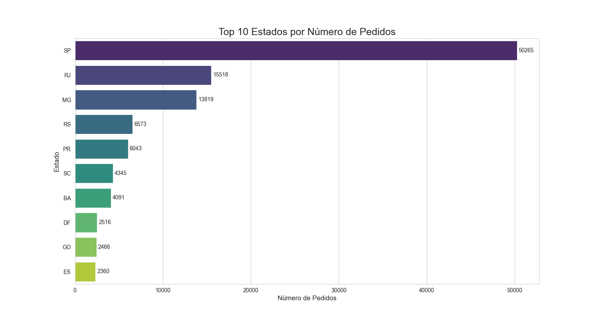
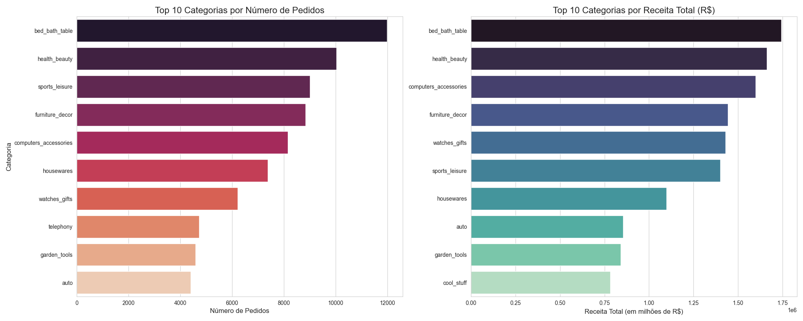
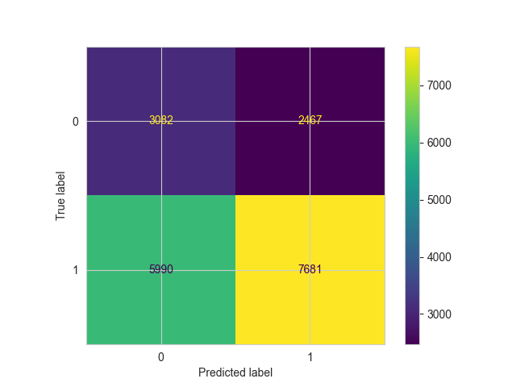

# Projeto de Análise de Dados: Previsão de Churn no E-commerce Brasileiro

## ✒️ Autor
**Victor Hugo**
* **LinkedIn:** [https://www.linkedin.com/in/victor-h-almeida/](https://www.linkedin.com/in/victor-h-almeida/)
* **GitHub:** [https://github.com/VictorHugo56](https://github.com/VictorHugo56)

---

## 🎯 Objetivo do Projeto

Este projeto realiza uma análise completa de ponta a ponta sobre um grande conjunto de dados de e-commerce brasileiro, com o objetivo de entender os principais fatores que levam à evasão de clientes (churn) e construir um modelo de machine learning capaz de prever quais clientes estão em risco. A análise culmina em um dashboard interativo no Power BI com recomendações estratégicas para o negócio.

---

## 📊 Dashboard Interativo no Power BI

**Clique na imagem abaixo para acessar o dashboard interativo completo publicado na web.**

---

## 🛠️ Tecnologias Utilizadas

* **Linguagens:** Python, SQL (PostgreSQL)
* **Bibliotecas Python:** Pandas, Matplotlib, Seaborn, Scikit-learn, XGBoost, imbalanced-learn, SHAP
* **Banco de Dados:** PostgreSQL
* **Ferramentas de BI:** Power BI
* **Ambiente:** Jupyter Notebook, VS Code, Git/GitHub

---

## 🔄 Metodologia Analítica

O projeto foi estruturado em 4 fases principais, seguindo as melhores práticas de um ciclo de vida de projetos de dados:

### Fase 1: Engenharia de Dados e Ambiente
* **Configuração do Ambiente:** Utilização de um servidor PostgreSQL local para simular um ambiente de produção.
* **Ingestão de Dados (ETL):** Desenvolvimento de um script Python (`ingest_data.py`) para automatizar a carga dos múltiplos arquivos CSV do dataset Olist para o PostgreSQL, tratando erros de codificação e garantindo a integridade dos dados.
* **Consulta Mestra:** Criação de uma query SQL complexa com múltiplos `LEFT JOINs` para consolidar as informações de 8 tabelas diferentes em uma única visão, formando a base para a análise.

### Fase 2: Análise Exploratória de Dados (EDA)
Nesta fase, o objetivo foi extrair insights e entender o comportamento do negócio e dos clientes. As principais análises foram:
* **Análise Temporal:** Visualização do crescimento das vendas e identificação de picos sazonais.

* **Análise Geográfica:** Mapeamento da concentração de clientes, confirmando o Sudeste como principal mercado.

* **Análise de Produtos:** Investigação da dinâmica "Volume vs. Valor", identificando as categorias que mais vendem contra as que mais faturam.

* **Análise de Satisfação:** Correlação entre atrasos na entrega e notas de avaliação, provando que a performance logística é um fator crítico para a satisfação do cliente.
* **Análise de Sentimento (NLP):** Uso de Nuvens de Palavras para extrair os principais temas dos comentários de clientes, confirmando que a "entrega" é o tema central tanto para elogios quanto para reclamações.

### Fase 3: Modelagem Preditiva (Machine Learning)
O objetivo desta fase foi construir um modelo para prever o churn.
* **Engenharia de Características:** Criação de features como Recência, Frequência e Valor (RFM), além da nota média de avaliação e outras métricas comportamentais.
* **Tratamento de Data Leakage:** Identificação e correção de vazamento de dados, removendo a feature `recency` para garantir um modelo preditivo honesto.
* **Modelagem:** Treinamento e avaliação de 3 algoritmos de classificação: Regressão Logística, Random Forest e XGBoost.
* **Balanceamento de Classes:** Aplicação da técnica SMOTE para lidar com o desbalanceamento entre clientes ativos e churners, melhorando a capacidade do modelo de identificar a classe minoritária.

### Fase 4: Interpretabilidade e Recomendações
* **Importância das Características:** Utilização do modelo treinado para identificar que a **nota média da avaliação** e a **frequência de compra** são os fatores mais importantes para prever o churn.
* **Recomendações Estratégicas:** Tradução dos insights em ações de negócio, como focar na otimização logística para melhorar a satisfação e criar campanhas de reengajamento para incentivar a segunda compra.

---

## 🚀 Como Executar o Projeto Localmente

1. Clone o repositório: `git clone https://github.com/VictorHugo56/Advanced_Data_Analysis.git`
2. Crie e ative um ambiente virtual.
3. Instale as dependências: `pip install -r requirements.txt`
4. Configure um servidor PostgreSQL e crie um banco de dados vazio.
5. Atualize a string de conexão no arquivo `scripts/ingest_data.py` e no notebook com suas credenciais.
6. Execute o script de ingestão: `python scripts/ingest_data.py`
7. Abra e execute o notebook `01_Analise_Exploratoria.ipynb`.